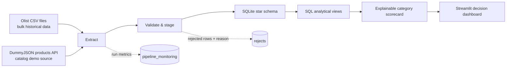
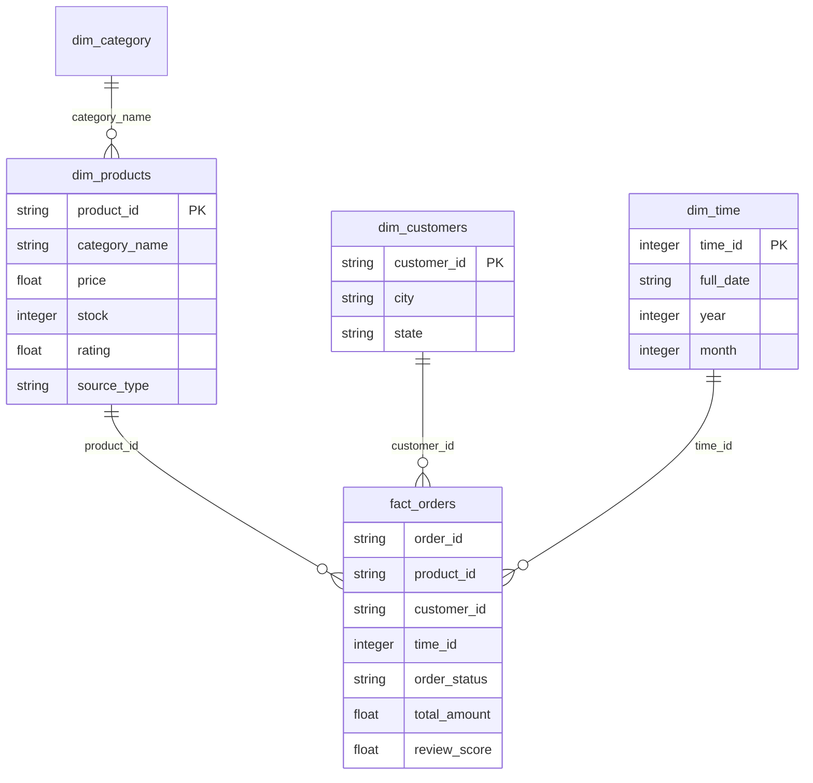

# E-commerce Decision Hub

> An end-to-end Python + SQL analytics pipeline that turns e-commerce orders, products, reviews, and catalog data into transparent category-prioritisation decisions.

[](#quick-start)
[](#data-model-and-sql)
[](#interactive-dashboard)

## Why this project exists

Raw e-commerce data does not answer a decision-maker’s real question: **where should we invest, test, watch, or fix next?**

This project builds a repeatable path from raw CSV and API data to an interactive decision dashboard. It combines data engineering discipline—staging, validation, reject logging, dimensional modeling, and pipeline monitoring—with an explainable category scorecard.

The result is deliberately not a black-box recommendation engine. Every recommendation can be traced to the SQL metrics behind it.

## Verified snapshot

The figures below are calculated from the current local SQLite database. They describe historical order data dated from **2016-09-04 through 2018-10-17**; they are not live marketplace metrics.

| Metric | Verified value | Definition |
|---|---:|---|
| Distinct orders | 98,666 | Unique `order_id` values in `fact_orders` |
| Order-line records | 102,425 | Rows in the order-item fact table |
| Recorded order value | R$15,711,808.25 | Sum of `total_amount` in `fact_orders` |
| Products ordered | 32,951 | Distinct `product_id` values in `fact_orders` |
| Average review score | 4.08 / 5 | Average available `review_score` in `fact_orders` |
| Categories scored | 73 | Categories in `decision_category_scorecard` |

## From data to decision



### Decision framework

The dashboard evaluates categories with an explainable 0–100 score. It is designed for portfolio prioritisation, not individual-customer prediction.

| Component | Weight | What it measures |
|---|---:|---|
| Demand-to-competition | 30% | Historical orders relative to available catalog products |
| 90-day order momentum | 25% | Recent orders compared with the preceding 90 days |
| Customer experience | 20% | Average review score |
| Fulfilment reliability | 15% | Share of orders with `delivered` status |
| Revenue contribution | 10% | Relative category revenue |

The scorecard converts these metrics into one of four actions:

- **INVEST** — prioritise catalog and marketing activity.
- **TEST** — demand is strong; validate growth before scaling.
- **WATCH** — momentum merits a targeted experiment.
- **FIX** — improve fulfilment or customer experience before expansion.

For example, the current scorecard ranks `computers` at **88.6**, with the action **INVEST: prioritise catalogue and marketing**. Its underlying figures are 181 historical orders, R$231,875.43 in recorded order value, and a 6.03 demand-to-competition ratio.

> **Interpretation guardrail:** the data supports category-level historic prioritisation. It does not include browsing, search, cart, or session events, so it cannot justify predicting what an individual customer will want next.

## Interactive dashboard

The Streamlit app provides a decision-focused UI instead of a terminal-only report:

- Filtered overview KPIs: orders, revenue, average order value, review score, and fulfilment rate
- Revenue trend and top-category visualisations
- Category decision scorecard with action labels and CSV download
- Pipeline-run and rejected-record monitoring views

Run the dashboard after the pipeline has generated `data/ecommerce.db`:

```powershell
.\.venv\Scripts\python.exe -m streamlit run streamlit_app.py
```

## Data model and SQL

The analytics layer uses a star schema:



Key SQL outputs:

| View | Decision use |
|---|---|
| `view_revenue_by_category_over_time` | Locate revenue patterns by category and month |
| `view_order_funnel_metrics` | Assess order-status distribution and value |
| `view_category_demand_vs_supply` | Compare orders with catalog size |
| `view_sentiment_vs_volume` | Relate review sentiment to order volume |
| `seo_opportunity_report` | Rank demand-to-competition opportunities |
| `decision_category_scorecard` | Assign transparent category scores and recommended actions |

## Project structure

```text
.
├── data/                         # Local raw data, database, and pipeline outputs (gitignored)
├── docs/                         # Architecture, schema, and query notes
├── sql/                          # Staging, star schema, transformations, and decision-KPI SQL
├── src/
│   ├── extract/                  # Dynamic CSV and API extractors
│   ├── load/                     # Staging validation and star-schema loading
│   ├── orchestrator/             # Full-run scheduler and monitoring logger
│   └── transform/                # SQL view execution and access helpers
├── main.py                       # CLI entry point
├── streamlit_app.py              # Dashboard entry point
├── test_pipeline.py              # End-to-end test runner
└── requirements.txt
```

## Quick start

### 1. Create the environment

```powershell
python -m venv .venv
.\.venv\Scripts\Activate.ps1
pip install -r requirements.txt
```

### 2. Add source data

Place supported Olist CSV files in `data/raw/`. The CSV extractor scans the directory and logs what it finds; exact filenames are not hardcoded.

The pipeline also requests the public DummyJSON products endpoint. It does not require an API key.

### 3. Run the pipeline

```powershell
python main.py --run-once --report
```

This initializes the database, extracts data, validates and stages records, builds the star schema, refreshes the SQL views, and logs the run in `pipeline_monitoring`.

### 4. Explore the dashboard

```powershell
python -m streamlit run streamlit_app.py
```

## Data quality and observability

- Invalid or incomplete input records are stored in the `rejects` table with a source and reason.
- Each full run writes status, timing, extracted rows, loaded rows, rejected rows, and errors to `pipeline_monitoring`.
- API extraction includes retries with exponential backoff.
- The project keeps source data, local databases, logs, virtual environments, and Streamlit secrets out of Git.

## Deployment note

This repository intentionally excludes the raw CSV files and local SQLite database. Before deploying to Streamlit Community Cloud, use a small approved demo database or connect the dashboard to a managed database. Do not publish raw data or secrets to a public repository.

## Documentation

- [Architecture](docs/architecture.md)
- [Database schema](docs/database_schema.md)
- [Query insights](docs/query_insights.md)

## Tech stack

Python · pandas · SQLAlchemy · SQLite · SQL · Streamlit · Plotly · requests · schedule
