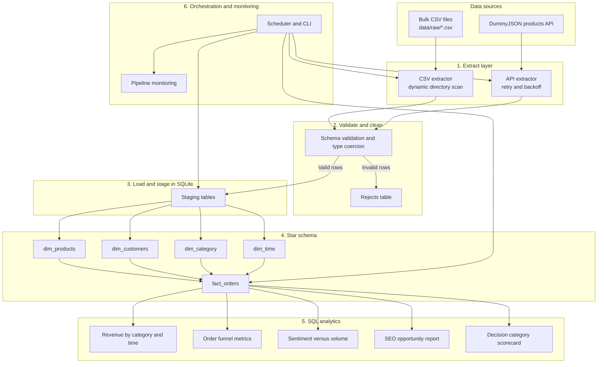

# E-Commerce Data Ingestion Pipeline - Architecture Documentation

## Pipeline Overview

This project implements a production-grade, end-to-end e-commerce data pipeline engineered to handle multi-source data ingestion, automated validation and cleaning, SQLite Star Schema storage, and SQL analytical view transformations.

---

## Technical Architecture Components

### 1. Extract Layer (`src/extract/`)
- **Bulk CSV Extractor (`csv_extractor.py`)**: Automatically scans `/data/raw/` for any `.csv` files. Reads schemas dynamically, logs file sizes, row counts, and column names without requiring hardcoded filenames.
- **Live API Extractor (`api_extractor.py`)**: Uses Python `requests` configured with `urllib3.util.Retry` (5 retries, 1.0s backoff factor) to handle network glitches, rate limits (HTTP 429), or 5xx server errors gracefully. Handles pagination via `limit` and `skip`.

### 2. Validate & Clean Layer (`src/load/staging_loader.py`)
- Filters missing primary keys (`order_id`, `product_id`, `customer_id`), corrupt data types, or invalid prices.
- Rejects are serialized into JSON strings and stored in the `rejects` table along with the target source table name, rejection timestamp, and exact reason.

### 3. Load Layer (`src/load/star_schema_loader.py`)
- Transforms raw staging data into a dimensional Star Schema.
- Standardizes product categories across Portuguese Olist files and English API categories using category translation mapping.

### 4. Transform Layer (`sql/*.sql` & `src/transform/sql_transformer.py`)
- DDL scripts create analytical views:
  - `view_revenue_by_category_over_time`
  - `view_order_funnel_metrics`
  - `view_category_demand_vs_supply`
  - `view_sentiment_vs_volume`
  - `seo_opportunity_report`

### 5. Orchestration & Monitoring (`src/orchestrator/scheduler.py`)
- Measures start time, end time, and total run duration.
- Counts extracted rows, loaded fact records, and rejected rows.
- Records all run metadata into `pipeline_monitoring`.
