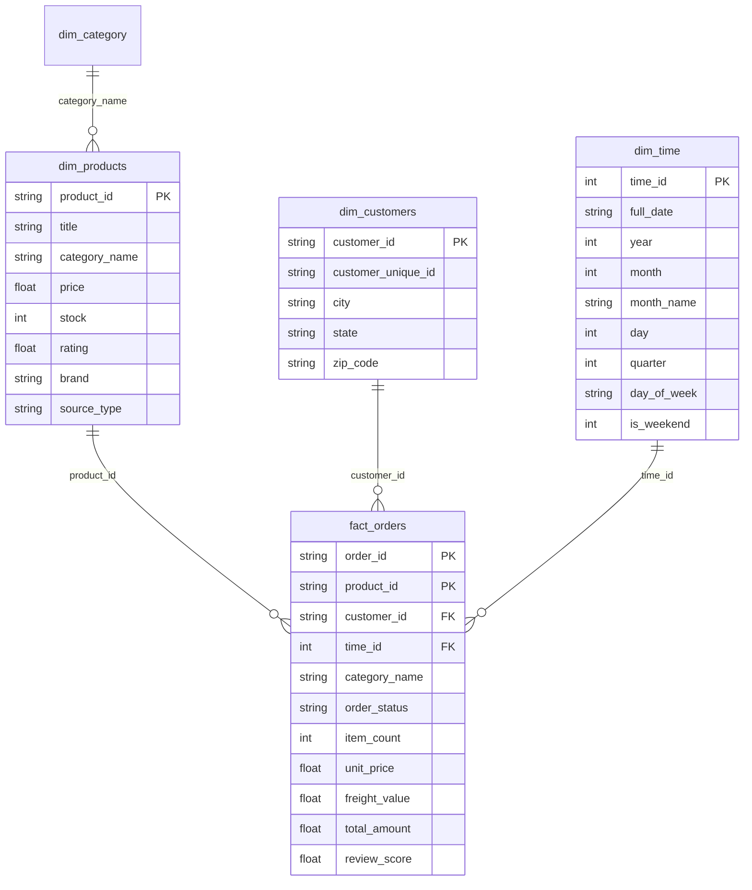

# E-Commerce Data Ingestion Pipeline - Database Schema Documentation

## ERD Diagram

---

## Data Dictionary

### Staging & Monitoring Tables

1. **`rejects`**: Stores rows that failed validation.
   - `id`: INTEGER PRIMARY KEY AUTOINCREMENT
   - `source_table`: TEXT (Name of staging table)
   - `rejected_row_data`: TEXT (JSON string of rejected row)
   - `rejection_reason`: TEXT (Reason for rejection)
   - `rejected_at`: TIMESTAMP (Default CURRENT_TIMESTAMP)

2. **`pipeline_monitoring`**: Audit table logging pipeline executions.
   - `id`: INTEGER PRIMARY KEY AUTOINCREMENT
   - `pipeline_name`: TEXT
   - `status`: TEXT (SUCCESS or FAILED)
   - `start_time`: TIMESTAMP
   - `end_time`: TIMESTAMP
   - `duration_seconds`: REAL
   - `extracted_rows`: INTEGER
   - `loaded_rows`: INTEGER
   - `rejected_rows`: INTEGER
   - `error_message`: TEXT

---

## Analytical SQL Views

1. **`seo_opportunity_report`**:
   - `category_name`: Product category.
   - `total_orders`: Cumulative order count (demand metric).
   - `total_revenue`: Cumulative revenue ($).
   - `catalog_product_count`: Number of active product listings (competition proxy).
   - `avg_product_price`: Average price of products in category.
   - `avg_review_score`: Average review rating score (1.0 to 5.0).
   - `demand_to_competition_ratio`: `total_orders / catalog_product_count`
   - `opportunity_rank`: `RANK() OVER (ORDER BY ratio DESC)`
   - `seo_strategy_recommendation`: Plain-English actionable guidance.

2. **`view_order_funnel_metrics`**:
   - Breakdown of order counts, percentage of total orders, total revenue, and average order value by `order_status` (delivered, shipped, canceled, invoiced, processing).

3. **`decision_category_scorecard`**:
   - An explainable category-prioritisation score from demand relative to catalog size (30%), recent 90-day order momentum (25%), average review score (20%), fulfilment rate (15%), and revenue contribution (10%).
   - Returns a plain-English `recommended_action`. This is a category-level decision aid based on historical orders, not a prediction of what an individual customer will buy.
